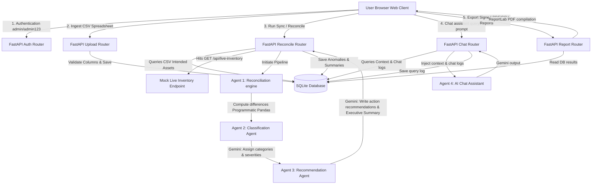

# System Architecture Diagram

This document explains the data flow, agent pipeline, and system integration topology of the Inventory Reconciliation Agent application.

---

## Data Pipeline Details

1. **Upload Phase**:
   - The user selects a target CSV file.
   - The system checks for the presence of the seven mandatory schema fields.
   - Rows are written directly to the `assets` table linked to a fresh `inventory_uploads` row.

2. **Reconciliation Phase**:
   - The Reconciliation Engine queries all intended items from the database.
   - It fetches actual server setups from the live inventory system.
   - Programmatic difference analysis checks match parameters, grouping drifts by hostname, environment, owner, and capacities.
   - The discrepancy list is fed to the **Gemini Classification Agent**, which calculates operational risk weights (Critical, High, Medium, Low).
   - This output is routed to the **Gemini Recommendation Agent**, which writes remediation tasks and the overall Markdown briefing.
   - Outputs are stored in `reconciliation_results` and `ai_reports`.

3. **Query Chat Phase**:
   - The user chats with the AI Assistant.
   - The system queries the latest reconciliation outcomes from the DB.
   - Prompt context is built and sent to the **Gemini Chat Agent**, providing the user with detailed insights into drift anomalies.
